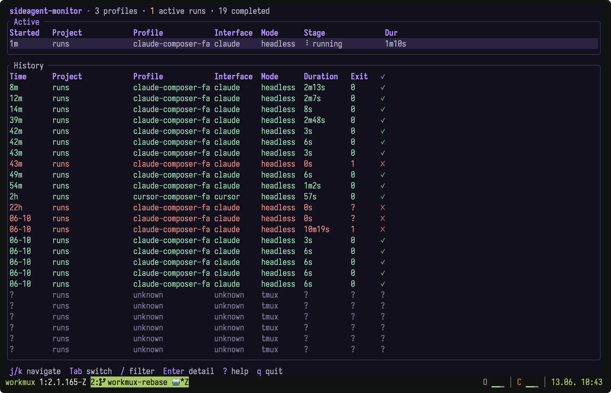
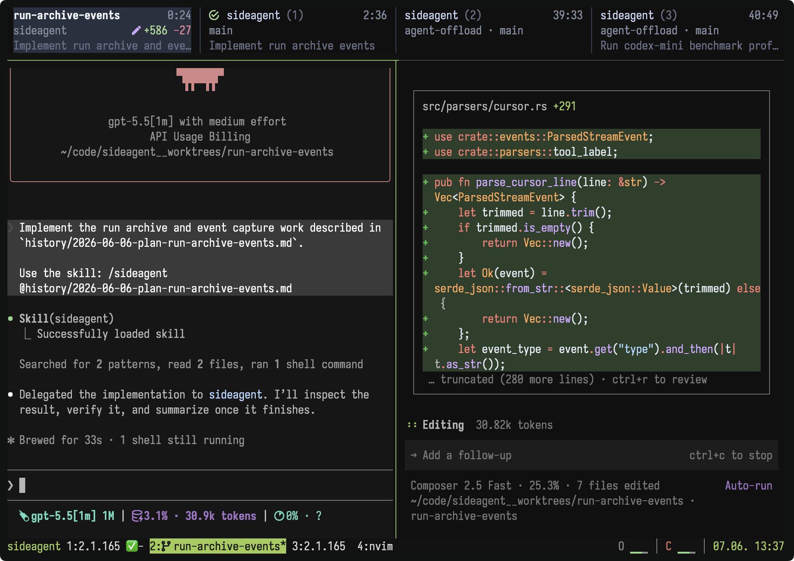
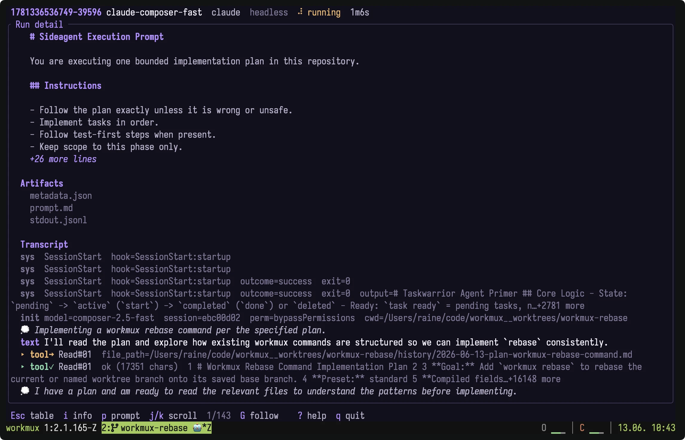

<h1 align="center">sideagent</h1>

<p align="center">
  <a href="#quick-start">Quick start</a> ·
  <a href="#configuration">Configuration</a> ·
  <a href="#commands">Commands</a>
</p>

`sideagent` launches another coding agent and blocks until that agent
completes. Use it when your main agent wants to delegate implementation work
while keeping the current conversation in control of review and verification.

## Why?

When you have a thorough implementation plan, the default model can be overkill
for the edit pass. The host agent should be able to hand that work to a cheaper
or faster model directly, without the user manually starting a new Codex,
OpenCode, or other agent session.

Claude Code can delegate to subagents, but that keeps delegation inside Claude's
own harness and model choices. Other agent harnesses have their own delegation
mechanisms and model support. For example, you might be inside Claude Code with
a plan ready to implement, but want Codex Spark or a DeepSeek V4 backed agent to
do the edit. The host agent should be able to start that run, pass the plan,
wait for completion, and review the result without asking the user to open and
manage a separate session.

`sideagent` makes offloading harness agnostic by starting the configured agent
CLI as a process. The host agent runs one blocking command, and the delegated
task opens in a new tmux pane or runs headlessly. When the run finishes, the
host agent can inspect the diff, run checks, and continue the review in the
original conversation.





## What it does

- Launches configured agent profiles in tmux or headless mode
- Passes prompts using the format each agent CLI expects
- Waits for completion using tmux files or headless CLI protocol signals
- Supports per-profile arguments and environment variables

## Quick start

### 1. Install

```bash
# Shell script, macOS/Linux
curl -fsSL https://raw.githubusercontent.com/raine/sideagent/main/scripts/install.sh | bash

# Homebrew
brew install raine/sideagent/sideagent

# Cargo from source
cargo install --git https://github.com/raine/sideagent --locked
```

### 2. Create a config

Create `.sideagent.yaml` in your project:

```yaml
profiles:
  codex-spark:
    command: codex
    args:
      - --model
      - gpt-5.1-codex-mini
```

Project configs replace user configs. See [Configuration](#configuration) for
the full discovery order, environment variables, and profile options.

### 3. Install the skill

```bash
sideagent install-skill
```

This adds `/sideagent` to every supported host agent with an existing config
directory. See [`install-skill`](#install-skill) for provider-specific installs
and default paths.

### 4. Delegate work

From Claude Code, invoke the installed skill:

```text
/sideagent implement the change in history/plan.md
```

The host agent loads the skill, chooses a configured profile, runs
`sideagent`, waits for the delegated run to complete, then reviews and reports
the result in the current conversation.

## How it works

Tmux runs get a directory under:

```text
~/.local/state/sideagent/runs/
```

The run directory contains:

| File        | Purpose                                               |
| ----------- | ----------------------------------------------------- |
| `prompt.md` | The augmented prompt sent to the delegated agent      |
| `launch.sh` | The generated executable launcher script              |
| `done.md`   | The completion summary written by the delegated agent |

In tmux mode, `sideagent` appends instructions to the prompt telling the
delegated agent to write a concise summary to `done.md.tmp`, then atomically
rename it to `done.md`. The parent process waits for `done.md` to exist, then
kills the delegated pane. If the tmux pane closes first, the run fails instead
of hanging silently.

Headless runs execute the configured command in the current terminal and return
its exit status. Known streaming headless interfaces (`claude`, `codex`,
`cursor`, `opencode`) create a run directory with `metadata.json`, `stdout.jsonl`,
and `prompt.md` when applicable. Known interfaces use their machine-readable
output modes in headless mode so completion can be detected from CLI protocol
events instead of agent-written files. `sideagent` saves the full stdout JSONL
stream and prints a compact transcript tail plus the log path.

The delegated pane opens to the right of the tmux pane that runs
`sideagent`, even if another tmux client is viewing a different window.
Other panes in the window keep their existing layout scope.

## One-off benchmark

Out of curiosity, I ran a small real-world benchmark using the kind of
implementation work `sideagent` is meant to delegate. The task started from a
thorough implementation plan that had already been reviewed by multiple models.
Each model got three isolated attempts at the same
[run archive implementation plan](https://gist.github.com/raine/2c94e39be2e491663346c759c87a05e6):
adding metadata, JSONL events, raw logs, tmux pane capture, summaries, and
`runs` / `show` commands.

| Model                   | Median time | Score | What happened                                                                                |
| ----------------------- | ----------: | ----: | -------------------------------------------------------------------------------------------- |
| `composer-2.5-fast`     |    2m 1.16s |    88 | Fastest typical run, best typical host score, and safest default choice from this benchmark. |
| `gpt-5.3-codex-spark`   |   2m 58.32s |    82 | Produced the best single attempt, but reviewers disagreed strongly about that result.        |
| `deepseek-v4-flash[1m]` |   6m 29.23s |    76 | Completed every trial, but was slower and had the lowest typical host score.                 |
| `gpt-5.5`               |   6m 43.33s |    66 | Low effort Codex passed checks, but failed acceptance in every trial.                        |
| `gpt-5.4-mini`          |   7m 49.72s |    62 | Passed checks, but was slowest and failed acceptance in every trial.                         |

The main failures were subtle implementation issues, not obvious missing
features: parsing real streamed output, avoiding large log reads, preserving the
CLI contract end-to-end, and cleaning up child processes or tmux panes after
errors.

This is one benchmark on one implementation task, not a universal model ranking.
See the
[full benchmark report](https://gist.github.com/raine/85ceb6d752baca6e03b9a7e0b4eb5e0d)
for methodology, timings, reviews, and limitations.

## Configuration

`sideagent` selects a config in this order:

1. `--config <path>`
2. The nearest `.sideagent.yaml` in the current directory or an ancestor up to
   your home directory
3. `~/.config/sideagent/config.yaml`

A discovered project config replaces the user config completely. Configs are not
merged. Project discovery stops after checking your home directory.

Project configs can contain commands and environment variables. Do not commit
secrets in `.sideagent.yaml`. Use `from_env` instead.

A config has a default profile and one or more named profiles. Top-level
`headless: true` runs every profile without tmux. This example uses Codex Spark
and a DeepSeek-backed Claude Code profile:

```yaml
default_profile: claude-deepseek-flash
headless: false

profiles:
  codex-spark:
    command: /opt/homebrew/bin/codex
    interface: codex
    args:
      - --model
      - gpt-5.3-codex-spark
      - -c
      - model_reasoning_effort="high"
    env: {}
    prompt: argument

  claude-composer-fast:
    command: /Users/raine/.local/bin/claude
    interface: claude
    args:
      - --dangerously-skip-permissions
    env:
      ANTHROPIC_BASE_URL: http://localhost:18765 # claude-code-proxy
      ANTHROPIC_AUTH_TOKEN: anything
      ANTHROPIC_MODEL: 'composer-2.5-fast'
      ANTHROPIC_SMALL_FAST_MODEL: 'composer-2.5-fast'
      CLAUDE_CODE_DISABLE_NONESSENTIAL_TRAFFIC: '1'
      CLAUDE_CODE_DISABLE_AUTO_MEMORY: '1'
      CLAUDE_CODE_DISABLE_NONSTREAMING_FALLBACK: '1'
      CLAUDE_CODE_EFFORT_LEVEL: max
      CLAUDE_CODE_ENABLE_TELEMETRY: '0'
    prompt: argument

  claude-deepseek-flash:
    command: /Users/raine/.local/bin/claude
    interface: claude
    args:
      - --dangerously-skip-permissions
    env:
      ANTHROPIC_BASE_URL: https://api.deepseek.com/anthropic
      ANTHROPIC_AUTH_TOKEN:
        from_env: DEEPSEEK_API_KEY
      ANTHROPIC_MODEL: 'deepseek-v4-flash[1m]'
      ANTHROPIC_SMALL_FAST_MODEL: 'deepseek-v4-flash[1m]'
      ANTHROPIC_DEFAULT_OPUS_MODEL: deepseek-v4-flash
      ANTHROPIC_DEFAULT_SONNET_MODEL: deepseek-v4-flash
      ANTHROPIC_DEFAULT_HAIKU_MODEL: deepseek-v4-flash
      CLAUDE_CODE_SUBAGENT_MODEL: deepseek-v4-pro
      CLAUDE_CODE_DISABLE_NONESSENTIAL_TRAFFIC: '1'
      CLAUDE_CODE_DISABLE_NONSTREAMING_FALLBACK: '1'
      CLAUDE_CODE_EFFORT_LEVEL: max
      CLAUDE_CODE_ENABLE_TELEMETRY: '0'
    prompt: argument

  cursor-composer:
    command: /Users/raine/.local/bin/cursor-agent
    interface: cursor
    args:
      - --force
      - --model
      - composer-2.5-fast
    env: {}
```

### Config fields

| Field             | Description                              | Default  |
| ----------------- | ---------------------------------------- | -------- |
| `default_profile` | Profile used when `--profile` is omitted | Required |
| `headless`        | Run every profile without tmux           | `false`  |
| `profiles`        | Named profile map                        | Required |

Headless mode is enabled when `--headless`, top-level `headless`, or
profile-level `headless` is true.

### Profile fields

| Field       | Description                                  | Default    |
| ----------- | -------------------------------------------- | ---------- |
| `command`   | Binary or script to execute                  | Required   |
| `interface` | Argument shape for the agent CLI             | `generic`  |
| `args`      | Extra arguments passed before the prompt     | `[]`       |
| `env`       | Environment variables exported before launch | `{}`       |
| `prompt`    | How the augmented prompt is delivered        | `argument` |
| `headless`  | Whether to run this profile without tmux     | `false`    |

### Interfaces

| Interface  | Prompt argument form         |
| ---------- | ---------------------------- |
| `generic`  | `-- "$PROMPT_CONTENT"`       |
| `claude`   | `-- "$PROMPT_CONTENT"`       |
| `codex`    | `-- "$PROMPT_CONTENT"`       |
| `cursor`   | `-- "$PROMPT_CONTENT"`       |
| `opencode` | `--prompt "$PROMPT_CONTENT"` |

### Prompt delivery

| Value             | Behavior                                                     |
| ----------------- | ------------------------------------------------------------ |
| `argument`        | Pass the prompt using the selected interface's argument form |
| `stdin`           | Redirect the prompt file to stdin                            |
| `prompt-file-arg` | Replace `{prompt_file}` in `args` with the prompt file path  |

Use `prompt-file-arg` only when at least one arg contains `{prompt_file}`.

### Headless completion

Headless mode chooses completion detection from `interface`:

| Interface  | Added headless output flags                | Completion signal                    |
| ---------- | ------------------------------------------ | ------------------------------------ |
| `generic`  | None                                       | Child process exit                   |
| `claude`   | `--output-format stream-json --verbose`    | JSON line with `type=result`         |
| `codex`    | `--json`                                   | JSON line with turn finished event   |
| `cursor`   | `--print --output-format stream-json`      | JSON line with `type=result`         |
| `opencode` | `--format json`                            | JSON stream ends when the CLI exits  |

For interfaces with terminal events, `sideagent` fails if the process exits
without seeing the expected event. If the child already failed, that exit status
is still preserved. Known headless interfaces write the raw stdout JSONL stream to
`stdout.jsonl` under the run directory and print the last 30 compact rendered
transcript lines. `generic` profiles keep stdout pass-through behavior.

Known streaming headless interfaces create a run directory with:

| File            | Purpose                                                     |
| --------------- | ----------------------------------------------------------- |
| `metadata.json` | Profile, command, interface, timestamps, status, exit code  |
| `stdout.jsonl`  | Raw machine-readable stdout stream                          |
| `prompt.md`     | Prompt file for `prompt-file-arg` profiles                  |

`metadata.json` is written when the run starts with `status: "running"` and is
replaced atomically when the run exits. Completed runs record `status`,
`completed_at`, `exit_code`, `completion_event_seen`, and `failure` when
`sideagent` detects a lifecycle error. `generic` keeps stdout pass-through;
`generic` `prompt-file-arg` runs may create `prompt.md` but do not create a
machine-readable stdout archive.

### Environment variables

Literal values are written directly:

```yaml
env:
  CLAUDE_CODE_ENABLE_TELEMETRY: '0'
```

Values can also be forwarded from the host environment:

```yaml
env:
  API_KEY:
    from_env: MY_SECRET_KEY
```

Environment variable names must be valid shell identifiers.

## Commands

### `run`

Launch a profile with a prompt and wait for completion.

```bash
sideagent run --profile claude-deepseek-flash "fix the failing tests"
cat history/plan.md | sideagent run --profile codex-spark
```

The `run` subcommand is optional, so this is equivalent:

```bash
sideagent --profile claude-deepseek-flash "fix the failing tests"
```

Options:

| Option                 | Description                               |
| ---------------------- | ----------------------------------------- |
| `-p, --profile <name>` | Profile name from the selected config     |
| `--config <path>`      | Use this config file instead of discovery |
| `-H, --headless`       | Run this invocation in headless mode      |

### `monitor`

Open a terminal UI for known streaming headless run archives.

```bash
sideagent monitor
sideagent monitor --runs-root ~/.local/state/sideagent/runs --poll-interval-ms 500
```

The monitor reads run directories under `~/.local/state/sideagent/runs/` by
default. It uses `metadata.json` for table rows and status, and tails
`stdout.jsonl` for the selected run detail view. Running archives with a stored
process id, tmux pane id, or archive owner process id are reconciled with live
process state, so dead stale runs move to History as failed instead of staying
Active forever. The table view shows Active and History sections. Use `Tab` to
switch focus, `Up` and `Down` or
`k` and `j` to navigate, `Enter` to open detail, `i` to show run metadata, `p`
or click the prompt section to expand long markdown prompts, `G` to follow live
output at the bottom, `Esc` to return from detail, `/` to filter history, `?` for
help, and `q` to quit.



Options:

| Option                        | Description                                      |
| ----------------------------- | ------------------------------------------------ |
| `--runs-root <path>`          | Read run archives from a custom directory        |
| `--poll-interval-ms <millis>` | Refresh runs and transcript output at this rate  |

### `profiles`

List configured profiles and mark the default.

```bash
sideagent profiles
sideagent profiles --config ./.sideagent.yaml
```

### `install-skill`

Install the bundled skill for one provider or all detected providers.

```bash
sideagent install-skill
```

```bash
sideagent install-skill --provider claude
```

Without `--provider`, the command installs to detected provider config
directories. A provider is detected when its config directory already exists. If
no provider config directories are found, the command exits with an error and
lists the checked paths.

With `--provider`, the command installs only for that provider and creates the
skill directory as needed.

The default Claude Code install root is `~/.claude`, or `CLAUDE_CONFIG_DIR` when
that variable is set. The default Pi install root is `~/.pi/agent`, or
`PI_CODING_AGENT_DIR` when that variable is set.

The command is idempotent. It prints `up-to-date` when the installed skill
matches the bundled copy.

## Agent workflow

A typical host-agent workflow looks like this:

```text
> /sideagent implement the plan in history/2026-06-06-plan-feature.md with the spark profile

The host agent:
1. Loads the `sideagent` skill
2. Pipes the plan into `sideagent run --profile codex-spark`
3. Waits for the delegated run to complete
4. Inspects the diff and runs the requested checks
5. Reports the reviewed result
```

The delegated agent should do the implementation. The host agent should still
inspect the diff, verify behavior, and decide what to report or commit.

## Requirements

- Rust, for building from source
- At least one configured agent CLI
- tmux, for non-headless runs

Non-headless runs must be started from inside an existing tmux pane. Headless
runs do not require tmux.

## Development

```bash
git clone https://github.com/raine/sideagent.git
cd sideagent
just check
```

`just check` runs formatting, clippy fixes, build, tests, and clippy.

Useful commands:

```bash
just run --help
just run profiles --config history/2026-06-06-sample-config.yaml
```

## Related projects

- [workmux](https://github.com/raine/workmux) - git worktrees and tmux windows for parallel agent workflows
- [consult-llm](https://github.com/raine/consult-llm) - ask other LLMs for planning, review, and debugging help
- [claude-history](https://github.com/raine/claude-history) - search, inspect, and resume Claude Code conversations
- [git-surgeon](https://github.com/raine/git-surgeon) - non-interactive hunk staging and commit surgery for agents
- [tmux-agent-usage](https://github.com/raine/tmux-agent-usage) - show AI agent rate limit usage in tmux status bars
